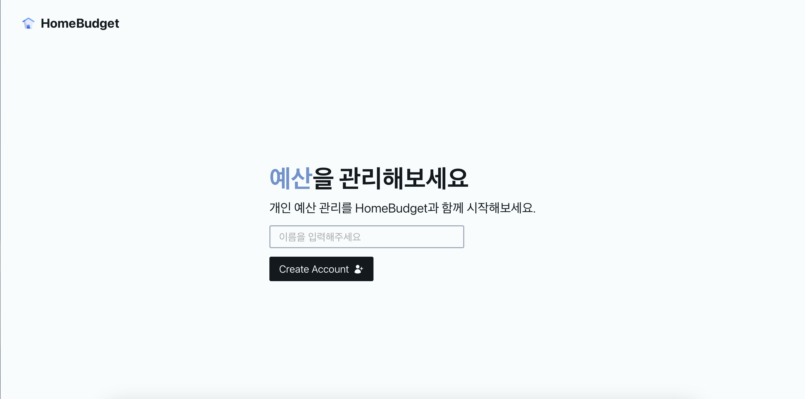

<h1 align="center">
    <a href="https://react-router-budget-seven.vercel.app">
    
    Budget App
    </a>
</h1>

  <i align="center">React.js로 만든 나만의 가계부 웹사이트</i>

<h4 align="center">
    
    
    
</h4>

